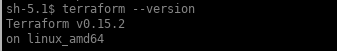
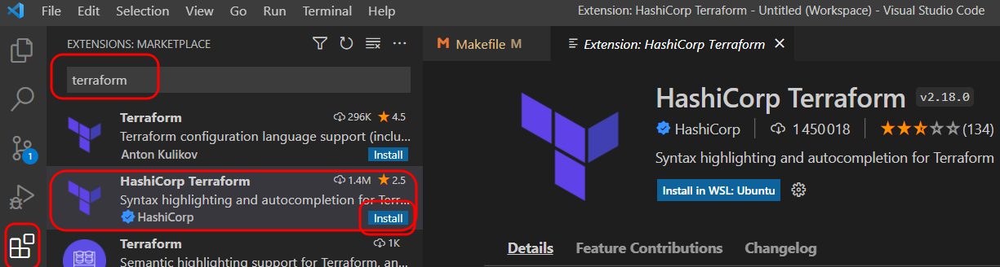
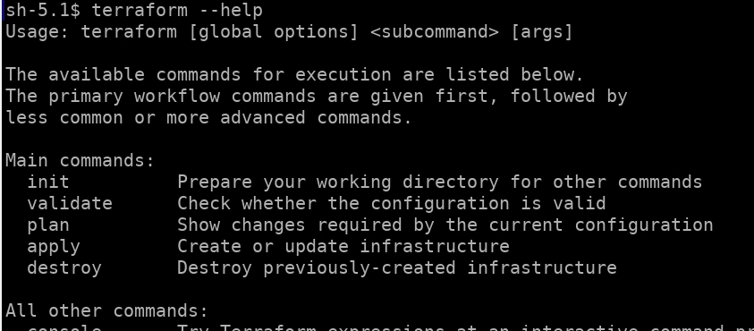

<!-- .slide: class="transition"-->

# Premiers pas avec Terraform

##==##
<!-- .slide:  -->
# Installation

* Via le package disponible sur le [site officiel]("https://www.terraform.io/downloads.html") (disponible pour tous les OS)

* Via Brew (MacOS) : `brew install terraform`

*  [tfenv](https://github.com/tfutils/tfenv) est un outil communautaire qui permets d'installer une version précise de terraform de façon assez pratique (MacOs et Linux)

* Ou avec docker `alias tf="docker run --rm -it --env-file <(env | grep TF_) -w /source -v "$(pwd):/source" -v ${HOME}:/root/ hashicorp/terraform:1.0.5"`

Notes:
Le logiciel est sous la forme d’un binaire (pré-compilé pour différents OS).

##==##
<!-- .slide: -->

# Le choix de l'IDE
<br/>

Plusieurs IDE disponibles :  
* Intellij
* Atom
* Visual Studio Code (Notre choix)
* Sublime Text
* VIM

Notes:
- Le choix de l'IDE est primordial avant même de se lancer dans l'utilisation de Terraform car il offre un confort d'utilisation supérieur par rapport à un éditeur de texte classique.
- Les fonctionnalités proposées vont de la coloration syntaxique à la complétion automatique.
- Intellij (en version payante) propose des fonctionnalités très avancées.

##==##
<!-- .slide: class="exercice" -->

# Atelier - Installons tous les outils 1/2

<br/>

1. Installons la dernière version de terraform : <br>
    => [https://www.terraform.io/downloads](https://www.terraform.io/downloads)

    Vérifions l'installation sur la ligne de commande:<br>
    `terraform --version` <br>
    

2. Installons git: <br>

    => [https://git-scm.com/downloads](https://git-scm.com/downloads)

    Utilisé pour extraire les exercices.

##==##
<!-- .slide: class="exercice" -->

# Atelier - Installons tous les outils 1/2

<br/>

1. Installons notre IDE : <br>
    => [https://code.visualstudio.com/Download](https://code.visualstudio.com/Download)

2. Sur VisualStudio code, installons le plugin terraform:

    

##==##
<!-- .slide: class="exercice" -->

# Atelier - Regardons la commande terraform - 2/2

<br>



##==##
<!-- .slide: -->

# Utilisation

## Terraform init

Cette commande permet d’initialiser le répertoire de travail courant.

* Lit le fichier configuration personnel ~/.terraformrc si existant 
* Télécharge les providers et provisioners nécessaires (officiels) sur https://registry.hashicorp.com/
* Instancie le fichier d’état (local ou distant)
* Effectue un “terraform get“ si nécessaire.
* Un fichier *.terraform.lock.hcl* sera automatiquement créé pour garantir l'intégrité des dépendances

Notes:
Cette commande est nécessaire d’être joué dans chaque nouveau dossier mais également lors de l’ajout d’une ressource provenant d’un nouveau provider.

Elle permet également la migration d’un fichier d’état d’un support vers un autre (cf module gestion du fichier d’état).

##==##
<!-- .slide:-->

# Utilisation

## Terraform plan

Terraform plan va scanner l’ensemble des fichiers *.tf du répertoire courant et comparer le résultat au contenu du fichier d’état (“terraform.tfstate”).

<br/>

Il s’agit d’un dry-run. Aucune modification/écriture ne sera effectuée sur le provider lors du 1er “plan”. Une relecture est faite par la suite pour comparer les états. Terraform vous signalera en cas de modification manuelle des objets référencés dans le fichier d'état.

<br/>

Le résultat peut être exporté en utilisant l’argument “-out” pour une application déportée ou désynchronisée.

<br/>

Terraform ne modifie/crée que les ressources qui nécessitent une modification.

##==##
<!-- .slide:-->

# Utilisation

## Terraform apply

Lors de l'exécution de cette commande, terraform effectue les appels APIs sur le provider pour créer/modifier/supprimer les ressources.

##==##
<!-- .slide:-->

# Utilisation

## Terraform destroy

Terraform destroy décommissionne les ressources présentes (et uniquement) dans le fichier d’état. Il ne modifie pas les ressources dont il n’a pas connaissance.

##==##
<!-- .slide: -->

# QUIZZ

<br/>

*Question* : Comment observer le déploiement d'une infrastructure sans l'exécuter ?

<br/>

1. Impossible
2. terraform fmt
3. terraform init
4. terraform plan
5. terraform show

##==##
<!-- .slide: -->

# QUIZZ

<br/>

*Question* : Comment observer le déploiement d'une infrastructure sans l'exécuter ?

<br/>

1. Impossible
2. terraform fmt
3. terraform init
4. **terraform plan**
5. terraform show

##==##
<!-- .slide: -->

# QUIZZ

<br/>

*Question* : Qu'est-ce que n'est pas terraform ?

<br/>

1. Un outil de provisionning d'infrastructure
2. Un outils de gestion de configuration 

##==##
<!-- .slide: -->

# QUIZZ

<br/>

*Question* : Qu'est-ce que n'est pas terraform ?

<br/>

1. Un outil de provisionning d'infrastructure
2. **Un outils de gestion de configuration**

##==##
<!-- .slide: -->

# QUIZZ

<br/>

*Question* : (Par défaut)Où est stocké le fichier d'état de Terraform ?

<br/>

1. Localement, en mémoire
2. Localement, dans le dossier courant
3. Sur un espace de stockage distant

##==##
<!-- .slide: -->

# QUIZZ

<br/>

*Question* : Où est stocké le fichier d'état de Terraform ?

<br/>

1. Localement, en mémoire
2. **Localement, dans le dossier courant**
3. Sur un espace de stockage distant

##==##
<!-- .slide: class="exercice" -->

# Executons notre premier code terraform 1/2 - Setup AWS

1. Récupérons les exercices

    ```bash
    git clone 
    ```

2. Configurer AWS

    
3. 